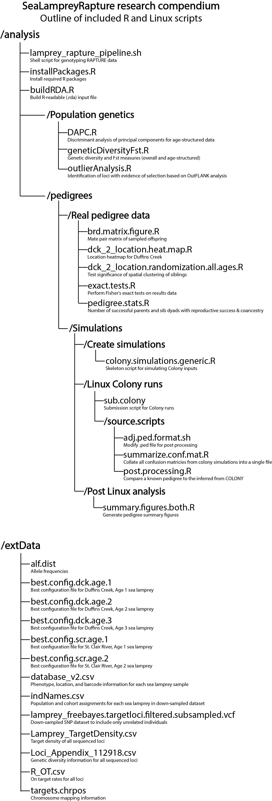

```{r setup, include=FALSE}
knitr::opts_chunk$set(echo = TRUE)
```

# Sea Lamprey Rapture 

[](https://zenodo.org/badge/latestdoi/194438082)

SeaLampreyRapture is a research compendium that brings together the data and analyses associated with *Sard et al. 2019. Rapture (RAD capture) panel facilitates analyses characterizing sea lamprey reproductive ecology and movement dynamics, Ecology and Evolution.* 

R analysis scripts are provided in analysis/, R source scripts are in src/, human-readable data in extData/, and R-readable data in an .rda file in data/. Detailed quantitative descriptions of the results of sea lamprey RAPTURE sequencing is available as an R Markdown file and in the README in /analysis. 

Note: All analyses originally conducted and package built using R version 3.5.1 in Windows 10

### To get started using the package

```{r eval=FALSE}
options(repos=structure(c(CRAN="http://cran.r-project.org")))
install.packages("devtools")
library(devtools)
install_github("ScribnerLab/SeaLampreyRapture")
```




#### Contact
Nick M. Sard  <br>
nicholas.sard@oswego.edu  <br> 
www.oswego.edu/biological-sciences/content/nicholas-m-sard <br>

Jared J. Homola  <br>
jaredhomola20@gmail.com <br> 
www.jaredhomola.com  

#### Copyright (c) 2019 ScribnerLab

Permission is hereby granted, free of charge, to any person obtaining a copy
of this software and associated documentation files (the "Software"), to deal
in the Software without restriction, including without limitation the rights
to use, copy, modify, merge, publish, distribute, sublicense, and/or sell
copies of the Software, and to permit persons to whom the Software is
furnished to do so, subject to the following conditions:

The above copyright notice and this permission notice shall be included in all
copies or substantial portions of the Software.

THE SOFTWARE IS PROVIDED "AS IS", WITHOUT WARRANTY OF ANY KIND, EXPRESS OR
IMPLIED, INCLUDING BUT NOT LIMITED TO THE WARRANTIES OF MERCHANTABILITY,
FITNESS FOR A PARTICULAR PURPOSE AND NONINFRINGEMENT. IN NO EVENT SHALL THE
AUTHORS OR COPYRIGHT HOLDERS BE LIABLE FOR ANY CLAIM, DAMAGES OR OTHER
LIABILITY, WHETHER IN AN ACTION OF CONTRACT, TORT OR OTHERWISE, ARISING FROM,
OUT OF OR IN CONNECTION WITH THE SOFTWARE OR THE USE OR OTHER DEALINGS IN THE
SOFTWARE.
