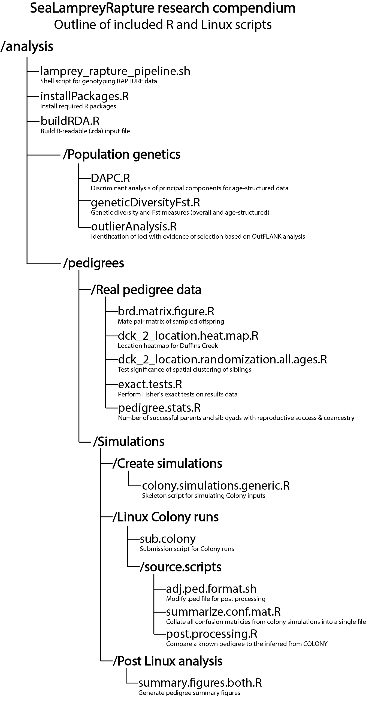

```{r setup, include=FALSE}
knitr::opts_chunk$set(echo = TRUE)
```

# Sea Lamprey Rapture

SeaLampreyRapture is a research compendium that brings together the data and analyses associated with Sard et al. (in review). R analysis scripts are provided in analysis/, R source scripts are in src/, human-readable data in extData/, and R-readable data in an .rda file in data/. 

Detailed quantiative descriptions of the results of sea lamprey RAPTURE sequencing is available in /analysis/Rapture panel details. 

Note: All analyses originally conducted and package built using R version 3.5.1 in Windows 10

### To get started using the package

```{r eval=FALSE}
options(repos=structure(c(CRAN="http://cran.r-project.org")))
install.packages("devtools")
library(devtools)
install_github("ScribnerLab/SeaLampreyRapture")
```





### Data in /extData
1. alf.dist: Allele frequencies
2. best.config.dck.age.1: Best configuration file for Duffins Creek, age 1 sea lamprey
3. best.config.dck.age.2: Best configuration file for Duffins Creek, age 2 sea lamprey
4. best.config.dck.age.3: Best configuration file for Duffins Creek, age 3 sea lamprey
5. best.config.scr.age.2: Best configuration file for St. Clair River, age 2 sea lamprey
6. best.config.scr.age.3: Best configuration file for St. Clair River, age 3 sea lamprey
7. database_v2: Phenotype, location, and barcode information for each sea lamprey sample
8. indNames: Population and cohort assignments for each sea lamprey in down-sampled dataset
9. lamprey_freebayes.targetloci.filtered.subsampled.vcf: Down-sampled SNP dataset to include only unrelated individuals
10. Lamprey_TargetDensity: Target density of all sequenced loci
11. Loci_Appendix_112918: Genetic diversity information for all sequenced loci
12. R_OT: On target rates for all loci
13. targets.chrpos: Chromosome mapping information


### Contact
Nick M. Sard  
nicholas.sard@oswego.edu  
www.oswego.edu/biological-sciences/content/nicholas-m-sard

Jared J. Homola  
jaredhomola20@gmail.com  
www.jaredhomola.com  


#### Copyright (c) 2019

Permission is hereby granted, free of charge, to any person obtaining a copy of this software and associated documentation files (the "Software"), to deal in the Software without restriction, including without limitation the rights to use, copy, modify, merge, publish, distribute, sublicense, and/or sell copies of the Software, and to permit persons to whom the Software is furnished to do so, subject to the following conditions:

The above copyright notice and this permission notice shall be included in all copies or substantial portions of the Software.

THE SOFTWARE IS PROVIDED "AS IS", WITHOUT WARRANTY OF ANY KIND, EXPRESS OR IMPLIED, INCLUDING BUT NOT LIMITED TO THE WARRANTIES OF MERCHANTABILITY, FITNESS FOR A PARTICULAR PURPOSE AND NONINFRINGEMENT. IN NO EVENT SHALL THE AUTHORS OR COPYRIGHT HOLDERS BE LIABLE FOR ANY CLAIM, DAMAGES OR OTHER LIABILITY, WHETHER IN AN ACTION OF CONTRACT, TORT OR OTHERWISE, ARISING FROM, OUT OF OR IN CONNECTION WITH THE SOFTWARE OR THE USE OR OTHER DEALINGS IN THE SOFTWARE.
