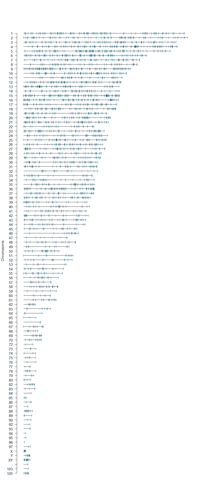
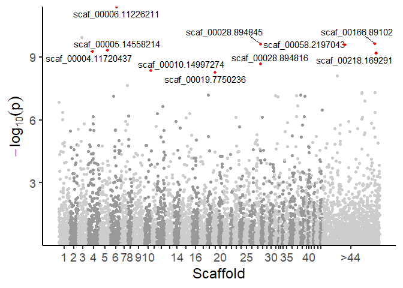
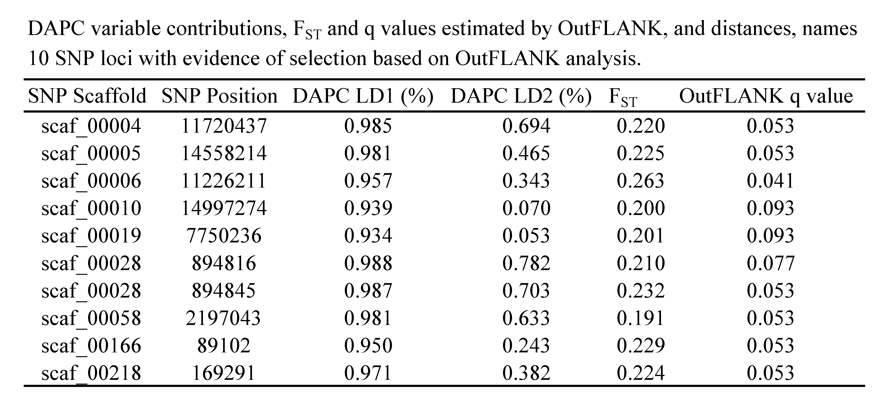

Contents
--------

-   [Introduction and Setup](#Introduction)
    -   [Install SeaLampreyRapture package](#SeaLampreyRapture)
    -   [Load required packages](#Packages)
-   [Sequencing profile](#SeqProfile)
    -   [On/off target reads per locus](#Target)
    -   [Allele balance](#AlleleBalance)
    -   [Chromosome plots](#Chromo)
    -   [Target density](#TargetDensity)
-   [Genetic variation](#GenVar)
    -   [Locus *F*ST values](#Fst)
    -   [Locus *F*IS values](#Fis)
    -   [Locus minor allele frequencies](#MAF)
-   [Outlier analysis](#Outlier)
    -   [Outlier locus summary table](#outlierSummary)

Introduction and Setup
----------------------

RAD capture (RAPTURE) provides a means of rapidly genotyping hundreds to
thousands of standardized restriction site associated (RAD) loci. Here
we provide a detailed characterization of a panel of 12,435 RAD loci
developed for sea lamprey management and research. The input file for
all the following analyses is appendedLoci, which is available in the
research compendium (R package) described below.

### Install SeaLampreyRapture package

The SeaLampreyRapture package includes all data necessary for performing
the following analyses. It can be download from GitHub using the
following R commands.

    options(repos=structure(c(CRAN="http://cran.r-project.org")))
    install.packages("devtools")
    library(devtools)
    install_github("ScribnerLab/SeaLampreyRapture")

### Load required packages

Interactively run /analysis/installPackages.R to ensure all necessary
packages are available

    library(adegenet)
    library(vcfR)
    library(hierfstat)
    library(tidyverse)
    library(gridExtra)
    library(ggthemes)
    library(SeaLampreyRapture)
    library(quantsmooth)
    library(OutFLANK)
    library(ggrepel)
    library(VariantAnnotation)
    library(snpStats)
    data(SeaLampreyRapture)

   

Sequencing profile
==================

The following section characterizes sequencing results. Specifically, we
evaluate the number of mapped reads for on and off-target loci, allele
read balance, and the density of targeted RAD loci across the genome.

### On/off target reads per locus

The number of mapped read pairs for RAD loci targeted with RAPTURE
(On\_Target) versus RAD loci that were not targeted (Off\_Target).
Overall, 80.6% of reads aligned to targeted loci even though they made
up less than 10% of all RAD loci. Results demonstrate that the target
enrichment assay was highly successful.

    p <- ggplot(onTarget_readCount, aes(x=ReadCount, fill = T)) +
      geom_histogram(binwidth = 10000, color = "black") +
      scale_fill_manual(values=c("deepskyblue3", "darkorange"))+
      facet_wrap(~T, scales = "free_y")

    p + ggtitle("") +
      xlab("Mapped Reads") + ylab("Locus Count") +
      theme_linedraw() +
      theme(strip.text.x = element_text(size = 14, angle = 0)) +
      theme(legend.position="none",
            text = element_text(size=14),
            axis.text.x = element_text(angle=0, hjust=1))

### Allele balance

Allele balance (AB) calculated for all SNPs in manuscript Table 1.
Allele balance is the proportion of reads supporting the reference
allele for heterozygous genotypes at a given locus (reported by
Freebayes). We expect values to be near 0.5 for diploid loci that are
not confounded by sequencing or mapping errors. We see that the
distribution of AB is centered on 0.5 and that the vast majority of SNPs
have values ranging from 0.25 to 0.75. At a small subset of loci, there
appears to be a bias toward sequencing the alternate allele (AB &lt;
0.25); however, these loci make up a small fraction of all genotyped
SNPs.

    s1 <- subset(appendixLoci, allele_balance < 0.7)
    s2 <- subset(s1, allele_balance > 0.3)

    p <- ggplot(appendixLoci, aes(x=allele_balance)) +
      geom_histogram(fill="deepskyblue3", color = "black", binwidth = 0.02) +
      xlim(c(0,1)) +
      geom_vline(xintercept = mean(appendixLoci$allele_balance), linetype = "dashed")

    p + ggtitle("") +
      xlab("Allele Balance for Heterozygous Genotypes (AB)") + ylab("SNP Count") +
      theme_linedraw()+
      theme(legend.position="none",
            text = element_text(size=14),
            axis.text.x = element_text(angle=0, hjust=1))

### Chromosome plots

#### Greater than 10 mb

Distribution of target RAD loci across the 44 largest scaffolds (&gt;10
mb) in the sea lamprey genome. Each horizontal black line represents a
scaffold and each vertical blue line represents the location of a
targeted RAD locus. A total of 2844 of 3446 targeted loci map to these
scaffolds (82.5%).

    dat45 <- subset(targets.chrpos, targets.chrpos$CHR < 45)
    chrompos <- prepareGenomePlot(dat45, cols = "grey50", paintCytobands = TRUE, bleach = 0, topspace = 1, cex = 2, sexChromosomes = FALSE)
    points(chrompos[,2],chrompos[,1]+0.05,pch="|", cex = 0.75, col="deepskyblue4")

#### Greater than 1 mb

Distribution of target RAD loci on scaffolds greater than 1 MB in
length. Each horizontal black line represents a scaffold and each
vertical blue line represents the location of a targeted locus. A total
of 3316 of 3446 targeted RAD loci map to these scaffolds (96.22%).

    dat106 <- subset(targets.chrpos, targets.chrpos$CHR < 106)
    chrompos <- prepareGenomePlot(dat106, cols = "grey50", paintCytobands = TRUE, bleach = 0, topspace = 1, cex = 2, sexChromosomes = FALSE)
    points(chrompos[,2],chrompos[,1]+0.05,pch="|", cex = 0.75, col="deepskyblue4")

### Target density

The mean density of targeted loci across scaffolds &gt;10MB in length
was 4.02 RAD loci per mega-base (SD = 1.30)

    data <- subset(targetDensity, chr_length > 10000000)
    mn <- mean(data$density)
    sd <- max(data$density)

    p <- ggplot(data, aes(x=density)) +
      geom_histogram(fill="deepskyblue3", color = "black", binwidth = 0.25) +
      xlim(c(-1,10)) +
      geom_vline(xintercept = mn, linetype = "dashed")

    p + ggtitle("") +
      xlab("Mean Number of Target RAD Loci Per Megabase") + ylab("Scaffold Count") +
      theme_linedraw()+
      theme(legend.position="none",
            text = element_text(size=14),
            axis.text.x = element_text(angle=0, hjust=1))

Genetic variation {\#GenVar} 
================================================

The following section characterizes inter and intra-population genetic
variation at SNP loci that were genotyped using RAPTURE. We first
generate a plot of *F*ST, then produce histograms of minor
allele frequency and *F*IS for each of 5 sampling locations.
We then detect loci putatively under selection using the “Outflank”
method (Whitlock and Lotterhos, 2015)

### Histogram of *F*ST values per locus

Distribution of *F*ST values for 11,818 SNP loci genotyped in
sea lamprey at five spawning sites. The dashed vertical line indicates
the mean *F*ST value.

    dat.fst <- appendixLoci %>% drop_na(Fst)
    Fst <- dat.fst$Fst
    mf <- mean(Fst)

    p <- ggplot(dat.fst, aes(x=Fst)) +
      geom_histogram(fill="deepskyblue3",color = "black", binwidth = 0.01) +
      geom_vline(xintercept = mf, linetype = "dashed")

    p + ggtitle("") +
      xlab("Fst") + ylab("Locus Count") +
      theme_linedraw()+
      theme(legend.position="none",
            text = element_text(size=14),
            axis.text.x = element_text(angle=0, hjust=1))

### *F*IS values per locus, per population

Distributions of *F*IS generally centered around zero for
11,818 SNP loci genotyped in sea lamprey at five spawning sites.

    CARP <- as.data.frame(cbind(appendixLoci$Fis_CARP, rep(x = "CARP", nrow(appendixLoci))))
    BR <- as.data.frame(cbind(appendixLoci$Fis_BR, rep(x = "BR", nrow(appendixLoci))))
    SC <- as.data.frame(cbind(appendixLoci$Fis_SC, rep(x = "SC", nrow(appendixLoci))))
    SM <- as.data.frame(cbind(appendixLoci$Fis_SM, rep(x = "SM", nrow(appendixLoci))))
    DCJ <- as.data.frame(cbind(appendixLoci$Fis_DUFFINS, rep(x = "DCJ", nrow(appendixLoci))))

    names(CARP) <- c("Fis", "Pop")
    names(BR) <- c("Fis", "Pop")
    names(SC) <- c("Fis", "Pop")
    names(SM) <- c("Fis", "Pop")
    names(DCJ) <- c("Fis", "Pop")

    FisTable <- rbind(CARP, BR, SC, SM, DCJ)
    FisTable$Fis <- as.numeric(as.character(FisTable$Fis))

    p <- ggplot(FisTable, aes(x=Fis, fill = Pop)) +
      geom_histogram(binwidth = 0.02, color = "black") +
      facet_wrap(~Pop,nrow = 5)

    p + ggtitle("") +
      xlab("Fis") + ylab("Locus Count") +
      theme_linedraw() +
      theme(strip.text.x = element_text(size = 14, angle = 0)) +
      theme(legend.position="none",
            text = element_text(size=14),
            axis.text.x = element_text(angle=0, hjust=1))

### Minor allele frequencies per locus, per population

Distributions of minor allele frequencies for 11,818 SNP loci genotyped
in sea lamprey at five spawning sites.

    CARP <- as.data.frame(cbind(appendixLoci$MAF_CARP, rep(x = "CARP", nrow(appendixLoci))))
    BR <- as.data.frame(cbind(appendixLoci$MAF_BR, rep(x = "BR", nrow(appendixLoci))))
    SC <- as.data.frame(cbind(appendixLoci$MAF_SC, rep(x = "SC", nrow(appendixLoci))))
    SM <- as.data.frame(cbind(appendixLoci$MAF_SM, rep(x = "SM", nrow(appendixLoci))))
    DCJ <- as.data.frame(cbind(appendixLoci$MAF_DUFFINS, rep(x = "DCJ", nrow(appendixLoci))))

    names(CARP) <- c("MAF", "Pop")
    names(BR) <- c("MAF", "Pop")
    names(SC) <- c("MAF", "Pop")
    names(SM) <- c("MAF", "Pop")
    names(DCJ) <- c("MAF", "Pop")

    MAFTable <- rbind(CARP, BR, SC, SM, DCJ)
    MAFTable$MAF <- as.numeric(as.character(MAFTable$MAF))
    MAFTable <- subset(MAFTable, MAF < 1 & MAF > 0)

    p <- ggplot(MAFTable, aes(x=MAF, fill = Pop)) +
      geom_histogram(binwidth = 0.01, color = "black") +
      facet_wrap(~Pop,nrow = 5)

    p + ggtitle("") +
      xlab("Minor Allele Frequency") + ylab("Locus Count") +
      theme_linedraw() +
      theme(strip.text.x = element_text(size = 14, angle = 0)) +
      theme(legend.position="none",
            text = element_text(size=14),
            axis.text.x = element_text(angle=0, hjust=1))

Outlier analysis
================

We performed an outlier analysis using OutFLANK (Whitlock & Lotterhos,
2015). A more comprehensively annotated version of this script is
available at /analysis/outlierAnalysis.R. The analysis identified 10
loci putatively under selection. Evaluation of the DAPC loadings
demonstrates that these loci contribute disproportionately to LD1, which
separates Duffin’s Creek from upper Great Lakes populations.

    dat <- genotypeToSnpMatrix(allLoci.vcf, uncertain=FALSE)
    dat1 <- as.data.frame(dat$genotypes@.Data)

    write.csv(dat1, "../tmp/data1temp.csv")
    dat1 <- read.csv("../tmp/data1temp.csv")

    dat1[dat1 == 0] <- 9
    dat1[dat1 == 1] <- 0
    dat1[dat1 == 2] <- 1
    dat1[dat1 == 3] <- 2

    dat1$pop <- indPops$Pop 

    genotype <- dat1[, 2:(ncol(dat1)-1)]
    ind <- paste("pop", dat1$pop) 
    locinames <- as.character(colnames(genotype)) 
    FstDataFrame1 <- MakeDiploidFSTMat(genotype, locinames, ind)

    ## Calculating FSTs, may take a few minutes...
    ## [1] "10000 done of 11818"

    out_trim <- OutFLANK(FstDataFrame1, NumberOfSamples=140, qthreshold = 0.1, Hmin = 0.1)

    P1 <- pOutlierFinderChiSqNoCorr(FstDataFrame1, Fstbar = out_trim$FSTNoCorrbar,
                                    dfInferred = out_trim$dfInferred, qthreshold = 0.1, Hmin=0.1)

    substrRight <- function(x, n){
      substr(x, nchar(x)-n+1, nchar(x))
    }

    P1$Index <- as.integer(rownames(P1))
    P1$label <- substr(P1$LocusName, 1, 100) # The names of loci
    P1$label <- substr(P1$label, 1, nchar(P1$label)-4)
    P1$transformed.p <- -log(P1$pvalues)
    P1$scaffold <- as.integer(substr(P1$LocusName, 7, 10)) # The names of scaffolds
    P1$scaffold[P1$scaffold > 44] <- 9999
    P1$scaffold <- factor(P1$scaffold)

    drops <- c("LocusName","He", "T1", "T2", "T1NoCorr", "T2NoCorr", "meanAlleleFreq", "pvalues",
               "pvaluesRightTail", "qvalues", "OutlierFlag")
    plotting.df <- P1[ , !(names(P1) %in% drops)]

    axis.df <- plotting.df %>% group_by(scaffold) %>%
      summarize(center = mean(Index)) %>%
      mutate(label = c("1", "2", "3", "4", "5", "6", "7", "8", "9", "10", " ", "", " ", "14", " ",
                       "16", " ", "", " ", "20", " ", "", " ", "", "25", "", " ", "", " ",
                       "30", " ", " ", " ", " ", "35", " ", " ", " ", " ", "40", " ", " ",
                       " ", " ", ">44"))

    ### Create Manhattan plot
    ggplot(P1, aes(Index, transformed.p, label = label)) +
      geom_point(aes(color = P1$scaffold)) +
      ylab(expression(-log[10](p))) +
      scale_colour_manual(values = rep(c("gray80", "gray60"), 48), aesthetics = "color") +
      geom_text_repel(
        data = subset(P1, OutlierFlag == "TRUE")
      ) +
      geom_point(data = P1[P1$OutlierFlag == "TRUE", ], color = "red", shape = 18) +
      scale_x_continuous(label = axis.df$label, breaks= axis.df$center, name = "Scaffold") +
      scale_y_continuous(expand = c(0, 0) ) + 
      theme_classic(base_size = 18) +
      theme(legend.position="none") +
      NULL

